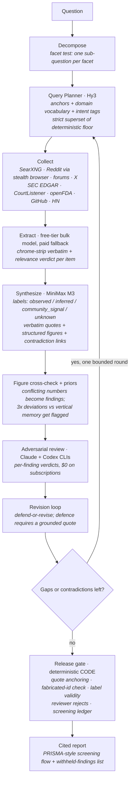

# Hermes Research Engine


An autonomous research engine built on [Nous Research's Hermes agent stack](https://github.com/NousResearch/Hermes-Agent). It takes a hard commercial question and returns a cited intelligence report that two independent reviewer models have already challenged. A typical run costs about five cents.

Those numbers are outputs of the repo's own instruments, not estimates: [`evals/capability_metrics.py`](evals/capability_metrics.py) computes retention and aim from the database, and [`evals/baseline-capability.json`](evals/baseline-capability.json) is the frozen baseline they are measured against.

A run works like this. You submit a question. An LLM planner decides what to search for rather than searching the words you typed. Collectors fan out across the open web, Reddit, forums, X, GitHub, Hacker News, SEC filings, court dockets, and FDA enforcement records. Evidence gets extracted and relevance-judged before synthesis, and every observed claim carries a verbatim quote from the source it cites. Two frontier models then challenge each finding, and anything they reject gets one defend-or-revise pass. The engine reads its own unanswered gaps and can run a second, sharper collection round off them. A deterministic release gate, written in code rather than as a prompt, decides what ships.

The engine is read-only. Nothing in it posts, sends, or replies.

## Why it exists

Generic LLM "deep research" produces generic answers because the retrieval underneath it is generic. This engine was built against a real commission, a market-entry diligence brief spanning 14 research runs, and each upgrade came from a measured failure rather than an impression:

| measured failure | fix | result |
|---|---|---|
| Consolidated brief kept only 98 of the 401 named entities its own findings contained (retention 0.244) | Brief prompts rewritten: named-specifics sections, a hard no-category rule, a `lost_specifics` critic dimension | retention 0.838 (336/401) from the same findings and the same models, at no extra cost |
| A regulatory question retrieved 305 items with 2 relevant. Deterministic query expansion could only delete words, never add the vocabulary answers are written in | LLM query planner: anchors, domain vocabulary, intent-tagged queries, composed as a strict superset of the deterministic floor | plan-only aim held at 1.00 while vocabulary novelty rose from 0.315 to 0.438 |
| Reviewer-rejected findings died silently and their critique text went unused | Revision loop: batched defend-or-revise, where a defence requires a verbatim quote or becomes a drop | a rejected finding gets a second chance, and reviewer overreach cannot strip a claim the evidence literally supports |
| Single-pass pipeline. The engine wrote its own follow-up questions as `unknown` findings and nothing ever read them | Gap-driven iteration: unknowns and unresolved contradictions spawn a bounded second collection round | convergence-gated deepening, with surviving gaps reported as gaps |
| Every conclusion argued from "the run looked better" | Offline eval harness plus a SQL capability scorecard, baseline frozen before any change | keep-or-revert decided on a number. The eval caught 2 real planner defects for $0.005 before any live run |

## Architecture



The security floor is two containers. The walled-source scraper (a Camoufox stealth browser) holds no real credentials and cannot read a single engine secret; everything it returns is tagged `UNTRUSTED_EVIDENCE` and treated as data rather than instructions. The reviewer container holds only CLI subscriptions and has no database access. Models propose findings, and the release gate decides which ones ship.

## The honesty machinery

Most of the engineering here goes into not lying, because a research engine that fails quietly produces confident garbage.

Every `observed` finding carries a short verbatim span from its cited evidence, and the gate string-matches that span (normalized for case and whitespace) against the stored text. Fabrication gets caught at the level of content rather than only at the level of citation ids.

Failure states are typed throughout. A parse failure cannot present itself as "no findings". A throttled search cannot present itself as "nothing was written about this". Any feature that fails soft has to leave a positive signal behind it, whether that is `plan_state`, a notes rollup, or the screening ledger.

Corroboration is counted by distinct author, so ten comments in one Reddit thread count as one report.

Contradictions are treated as signal. When a vendor claim conflicts with an operator complaint, the two ship as linked opposing findings instead of being averaged into one bland sentence, and an unresolved contradiction pushes the next collection round toward a third independent source class.

Withheld findings appear in the report along with the reason the gate held them back.

The consolidated brief is not allowed to genericize. A finding that names a company, a price, or a date has to survive into the brief by name, and the adversarial critic looks for `lost_specifics` explicitly.

## Evidence-driven development

The repo carries its own measurement instruments, and no prompt or retrieval change merges without beating the frozen baseline.

`evals/run_eval.py` runs an offline discovery-targeting eval over 10 hand-labelled questions with a deterministic scorer. In `--plan-only` mode it needs no network and no database. Its `--planner` mode exercises the real LLM planner for a few cents and caches the results.

`evals/capability_metrics.py` is a SQL-only scorecard covering retrieval aim, extraction liveness, finding specificity, brief entity retention, repair rate, gap closure, and a per-run screening ledger.

`docs/lessons.md` holds 30 numbered engineering lessons, running from "a reasoning model's think tokens spend from your max_tokens" to "a gate that only holds at one layer is not a gate".

Model choices come from bakeoffs rather than preference. Two of them (extraction fallback and synthesis) both concluded that the current model should stay: the cheaper candidate was systematically more permissive about relevance, and the more expensive one produced more findings carrying less entity density. Both bakeoffs together cost about $0.12.

## Cost profile

| item | cost |
|---|---|
| Typical full run (plan, collect, extract, synthesize, review, revise, iterate, report) | ~$0.05 |
| Worst case (paid extraction fallback fully engaged, deepening round) | ~$0.09 |
| Adversarial review and cross-run consolidation | $0, riding Claude and Codex CLI subscriptions |
| Search | $0, self-hosted SearXNG |
| Infra | one 4GB VPS plus the Neon Postgres free tier |

Model stack, pinned to exact slugs rather than aliases: Hy3 for the director and planner, MiniMax M3 for synthesis, the Nemotron free tier with a DeepSeek V4 Flash fallback for bulk extraction, and Claude Opus plus Codex via CLI for review.

## Repo map

```
pipeline/        the engine: run.py orchestrator, plan_queries, queries, select, extract,
                 synthesize, figures, priors, revise, followup, reviewers, release_gate, report
collectors/      legit-source adapters: SearXNG discovery, web reader, X, GitHub, HN, RSS,
                 SEC EDGAR, CourtListener, openFDA enforcement
reach/           isolated stealth-browser container (Camoufox): Reddit threads with comment
                 provenance, Trustpilot, forums, Instagram. Untrusted by construction
reviewer/        isolated reviewer container: Claude + Codex CLIs, per-finding adversarial
                 verdicts plus two-model cross-run synthesis (draft, critique, revise)
skills/          Hermes agent skills (research-decompose with the facet test, synthesis grading)
hermes-skills/   skills for the Hermes chat director (run-research, synthesize-project,
                 model-economics for cited unit economics via code execution)
evals/           eval harness, capability scorecard, frozen baselines
db/              Postgres schema and numbered migrations (001 to 014)
web/             Mission Control: FastAPI console (overview / research / chat / services / cost)
deploy/          VPS provisioning, container run scripts, watchdog, kill switch
docs/            lessons.md (the 30 engineering lessons) and internal/ working notes
                 (status.md build history, handoff.md, todo.md)
```

## Running it

You need a Linux VPS (4GB is enough; this ran on a Hetzner CX23), Docker, Python 3.12 or newer, a [Neon](https://neon.tech) Postgres database, and an [OpenRouter](https://openrouter.ai) API key. Claude and Codex CLI subscriptions are optional and give you the review layer at no incremental cost.

```bash
cp config/hermes.env.example .env        # fill in DATABASE_URL + OpenRouter key(s)
psql "$DATABASE_URL" -f db/schema.sql    # schema + source registry (idempotent)
bash deploy/searxng-run.sh               # self-hosted search, no key
python -m pipeline.submit --question "..." --sources web_search,reddit_threads,hackernews
python -m pipeline.run --run <id>        # report lands in evidence/ or Telegram if configured
```

Feature flags ship off so you can verify them against your own runs first: `PLANNER_ENABLED`, `MAX_REVISION_ROUNDS`, and `FOLLOWUP_ENABLED`, all documented in `config/hermes.env.example`. The walled-source container, the reviewer container, the Hermes chat director, and the Cloudflare-fronted console are each optional layers, and the core pipeline runs without any of them. The scripts in `deploy/` document the full topology. IPs and domains throughout the docs are placeholders.

```bash
python -m unittest discover tests        # 238 tests, pure/mocked, no network or DB needed
python -m evals.run_eval --plan-only     # score query planning offline, free
```

## Honest limitations

Judgment under ambiguity stays with the human reader. The engine states conflicts and gaps; it does not resolve the ones that genuinely need a phone call.

Vertical memory (the priors table) cold-starts. Below 5 observations for a subject it stays silent, and it records that it is staying silent.

X search covers only a recent window on the standard API tier, so the engine treats X as a freshness source instead of an archive.

Search-engine throttling is detected and reported, not defeated. Datacenter IPs get flagged, and a residential proxy path exists for the browser reader.

This is a research tool. What you point it at, and what you do with the reports, is your responsibility.

## Further reading

[`docs/lessons.md`](docs/lessons.md) holds the 30 numbered engineering failures behind the design
choices above, each with its root cause. [`HISTORY.md`](HISTORY.md) is the v1 to v3 build narrative.
[`CONTRIBUTING.md`](CONTRIBUTING.md) covers the keep-or-revert rule, the test conventions, and the
constraints a change has to respect.

## License

MIT, see [LICENSE](LICENSE). Fork it and point it at your own vertical.
