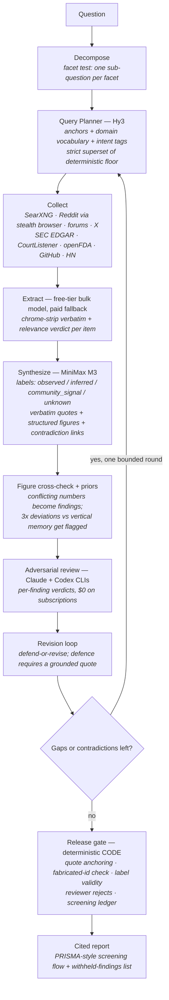

# Hermes Research Engine

**An autonomous, evidence-first research engine built on [Nous Research's Hermes agent stack](https://github.com/NousResearch/Hermes-Agent) — ask it a hard commercial question, get back a cited, adversarially-reviewed intelligence report for about five cents.**

Submit a question → an LLM planner decides what to *search for* (not just what you typed) → collectors fan across the open web, Reddit, forums, X, GitHub, HN, SEC filings, court dockets, and FDA enforcement records → evidence is extracted, relevance-judged, and synthesized into findings where **every observed claim carries a verbatim quote from its cited source** → two frontier-model reviewers adversarially challenge each finding → rejected findings get one defend-or-revise pass → the engine notices its own unanswered gaps and runs a second, sharper collection round → a deterministic release gate (code, not a model) decides what ships.

It reads and synthesizes. It never posts, sends, or engages.

## Why it exists

Generic LLM "deep research" produces generic answers because retrieval is generic. This engine was built and iterated against a real commission — a market-entry diligence brief across 14 research runs — and every upgrade was driven by a **measured** failure, not a vibe:

| measured failure | fix | result |
|---|---|---|
| Consolidated brief kept only **98 of 401** named entities its own findings contained (retention 0.244) | Brief prompts rewritten: named-specifics sections, hard no-category rule, `lost_specifics` critic dimension | **retention 0.838** (336/401), same findings, same models, $0 |
| A regulatory question retrieved 305 items, **2 relevant** — deterministic query expansion could only delete words, never add the vocabulary answers are written in | LLM query planner: anchors, domain vocabulary, intent-tagged queries — as a **strict superset** of the deterministic floor | plan-only aim held at 1.00, vocabulary novelty 0.315 → 0.438 |
| Reviewer-rejected findings died silently, critique text unused | Revision loop: batched defend-or-revise; a defence requires a verbatim quote or it becomes a drop | rejected ≠ deleted; reviewer overreach can't strip a true finding |
| Single-pass pipeline: the engine *wrote* its own follow-up questions (`unknown` findings) and nothing read them | Gap-driven iteration: unknowns + unresolved contradictions spawn a bounded second collection round | convergence-gated deepening, honest surviving gaps |
| Every conclusion argued from "the run looked better" | Offline eval harness + SQL capability scorecard, baseline frozen before any change | keep-or-revert on a number; the eval caught 2 real planner defects for **$0.005** before any live run |

## Architecture



Two-container security floor: the walled-source scraper (Camoufox stealth browser) holds **zero** real credentials and cannot read a single engine secret; everything it returns is tagged `UNTRUSTED_EVIDENCE` — data, never instructions. The reviewer container holds only CLI subscriptions and cannot touch the database. The release gate is code; models propose, the gate disposes.

## The honesty machinery

Most of the engineering here is about **not lying**, because a research engine that fails silently produces confident garbage:

- **Quote-anchored citations** — every `observed` finding carries a short verbatim span from its cited evidence; the gate string-matches it (normalized) against the stored text. Fabrication detection at content level, not just id level.
- **Typed failure states everywhere** — a parse failure can never masquerade as "no findings"; a throttled search can never masquerade as "nothing was written about this"; a dead fail-soft feature must leave a positive signal (`plan_state`, notes rollups, screening ledger).
- **Corroboration counted by distinct author** — ten comments in one Reddit thread are one report, not ten.
- **Contradiction is signal** — vendor claims and operator complaints are never averaged into one bland sentence; they ship as linked opposing findings, and unresolved contradictions drive the next collection round toward a third independent source class.
- **Withheld findings are listed, never vanished** — the report states what the gate held back and why.
- **The consolidated brief may not genericize** — a finding that names a company, price, or date survives by name; the adversarial critic hunts `lost_specifics` explicitly.

## Evidence-driven development

The repo carries its own measurement instruments, and no prompt or retrieval change merges without beating the frozen baseline:

- `evals/run_eval.py` — offline discovery-targeting eval (10 hand-labelled questions, deterministic scorer, no network or DB needed in `--plan-only`; `--planner` mode exercises the real LLM planner for cents, cached).
- `evals/capability_metrics.py` — SQL-only scorecard: retrieval aim, extraction liveness, finding specificity, brief entity retention, repair rate, gap closure, per-run screening ledger.
- `docs/lessons.md` — **30 numbered engineering lessons** learned the hard way, from "a reasoning model's think tokens spend from *your* max_tokens" to "a gate that only holds at one layer is not a gate". Arguably the most reusable file in the repo.

Model choices are measured, not vibed: two bakeoffs (extraction fallback, synthesis) both concluded **keep the current model** — the cheaper candidate was systematically more permissive on relevance, the fancier one produced more findings with *less* entity density. Total bakeoff spend: ~$0.12.

## Cost profile

| item | cost |
|---|---|
| Typical full run (plan → collect → extract → synthesize → review → revise → iterate → report) | **~$0.05** |
| Worst case (paid extraction fallback fully engaged, deepening round) | ~$0.09 |
| Adversarial review + cross-run consolidation | $0 (rides Claude/Codex CLI subscriptions) |
| Search | $0 (self-hosted SearXNG) |
| Infra | one 4GB VPS + Neon Postgres free tier |

Model stack (exact pinned slugs, never aliases): Hy3 (director/planner) · MiniMax M3 (synthesis) · Nemotron free tier with DeepSeek V4 Flash fallback (bulk extraction) · Claude Opus + Codex via CLI (review).

## Repo map

```
pipeline/        the engine: run.py orchestrator, plan_queries, queries, select, extract,
                 synthesize, figures, priors, revise, followup, reviewers, release_gate, report
collectors/      legit-source adapters: SearXNG discovery, web reader, X, GitHub, HN, RSS,
                 SEC EDGAR, CourtListener, openFDA enforcement
reach/           isolated stealth-browser container (Camoufox): Reddit threads with comment
                 provenance, Trustpilot, forums, Instagram — untrusted by construction
reviewer/        isolated reviewer container: Claude + Codex CLIs, per-finding adversarial
                 verdicts + two-model cross-run synthesis (draft → critique → revise)
skills/          Hermes agent skills (research-decompose with the facet test, synthesis grading)
hermes-skills/   skills for the Hermes chat director (run-research, synthesize-project,
                 model-economics — cited unit-economics via code execution)
evals/           eval harness + capability scorecard + frozen baselines
db/              Postgres schema + numbered migrations (001–014)
web/             Mission Control: FastAPI console (overview / research / chat / services / cost)
deploy/          VPS provisioning, container run scripts, watchdog, kill switch
docs/            lessons.md (the 30 engineering lessons) + internal/ working notes
                 (status.md build history, handoff.md, todo.md)
```

## Running it

Requirements: a Linux VPS (4GB is enough — this ran on a Hetzner CX23), Docker, Python 3.12+, a [Neon](https://neon.tech) Postgres database, an [OpenRouter](https://openrouter.ai) API key, and optionally Claude/Codex CLI subscriptions for the $0 review layer.

```bash
cp config/hermes.env.example .env        # fill in DATABASE_URL + OpenRouter key(s)
psql "$DATABASE_URL" -f db/schema.sql    # schema + source registry (idempotent)
bash deploy/searxng-run.sh               # self-hosted search, no key
python -m pipeline.submit --question "..." --sources web_search,reddit_threads,hackernews
python -m pipeline.run --run <id>        # report lands in evidence/ or Telegram if configured
```

Feature flags default **off** until you verify them on your own runs (`PLANNER_ENABLED`, `MAX_REVISION_ROUNDS`, `FOLLOWUP_ENABLED` — see `config/hermes.env.example`). The walled-source container, reviewer container, Hermes chat director, and Cloudflare-fronted console are each optional layers — the core pipeline runs without them. Deploy scripts in `deploy/` document the full topology; IPs and domains in the docs are placeholders.

```bash
python -m unittest discover tests        # 238 tests, pure/mocked, no network or DB needed
python -m evals.run_eval --plan-only     # score query planning offline, free
```

## Honest limitations

- Judgment under ambiguity remains human. The engine states conflicts and gaps; it does not resolve what genuinely requires a phone call.
- Vertical memory (priors) cold-starts: below 5 observations per subject it stays silent — and says so.
- X search covers a recent window only on the standard tier; the engine treats it as a freshness source, not an archive.
- Search-engine throttling is detected and reported, not defeated. Datacenter IPs get flagged; a residential proxy path exists for the browser reader.
- This is a research tool. What you research, and what you do with the reports, is on you.

## License

MIT — see [LICENSE](LICENSE). Fork it, gut it, point it at your own vertical.
